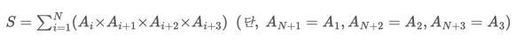
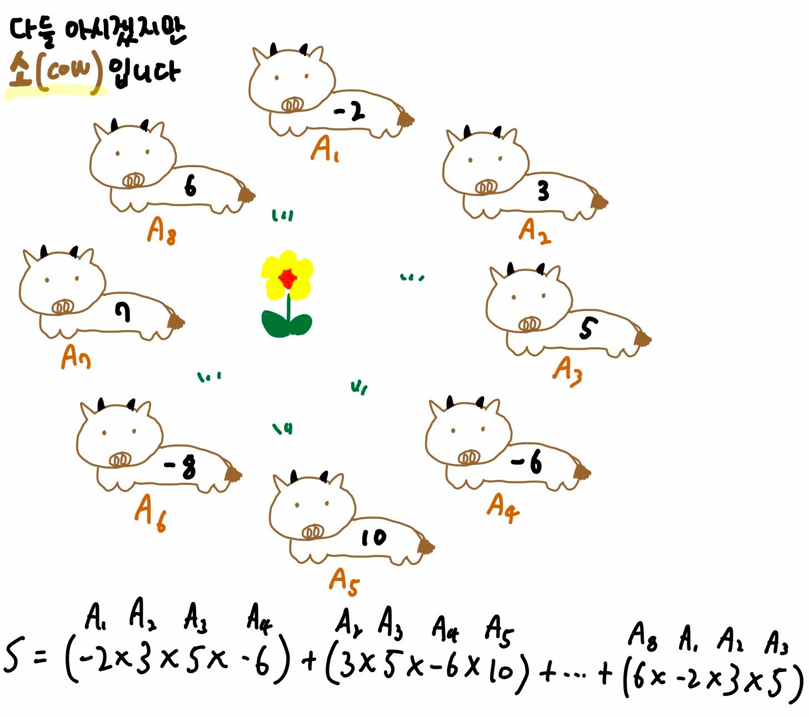

## 소가 정보섬에 올라온 이유
https://www.acmicpc.net/problem/17128

## 문제

소 N마리가 정보섬에 올라왔다!

소들은 정보섬 1층 앞마당에서 A1, A2, A3, ..., AN, A1의 순서대로 동그랗게 앉아 쉬고 있다. 각 소들에게는 품질 점수 Ai가 적힌 스티커가 붙어 있다. 욱제는 소 떼 옆에서 효빈이가 계산해 둔 어떤 계산 식을 발견했는데, 그것은 아래와 같다.

단
$S = \sum_{i=1}^N(A_{i}×A_{i+1}×A_{i+2}×A_{i+3}) \ \  (단,\ A_{N+1}=A_{1}, A_{N+2}=A_{2}, A_{N+3}=A_{3})$

풀어 쓰자면, 원형으로 둘러 앉은 소들에 대해서, 연속한 네 마리 소들의 품질 점수를 곱한 값을 모두 (정확히 한 번씩) 더한 것이다.

욱제는 효빈이가 학교를 떠나지 못하도록 심술부릴 작정이다. 욱제는 총 Q번에 걸쳐 어떤 i번째 소를 선택할 것이다. 그러고는 Ai가 적힌 스티커를 떼어내고, Ai*(-1)이 적힌 스티커를 붙일 작정이다. 그러면 효빈이는 Q번에 걸쳐서 S를 다시 계산해야 한다. 한 번 바꾼 스티커는 다음에 또 다시 바꾸지 않는 이상 계속 유지된다.

효빈이의 절친인 당신은 악동 욱제에게 괴롭힘 받는 효빈이를 도와 주기로 했다. 효빈이를 도와 S를 계산해 보자!
