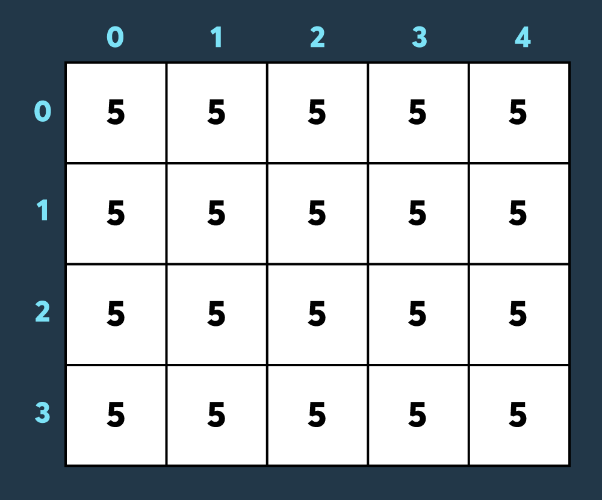
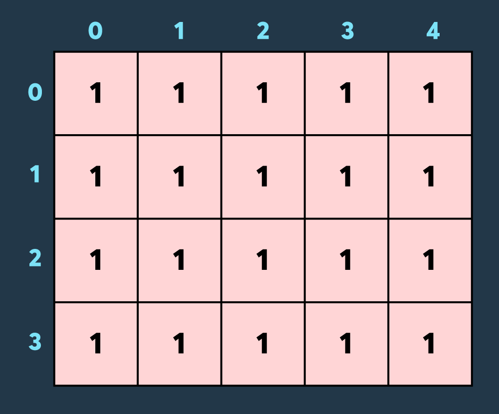
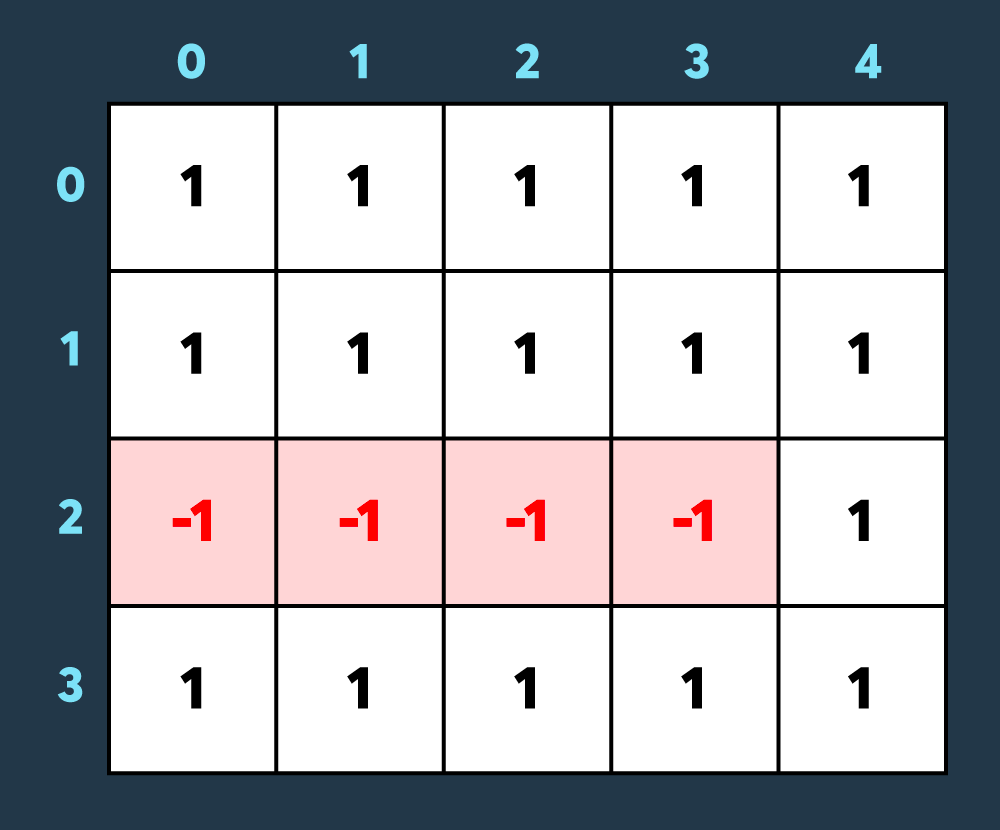
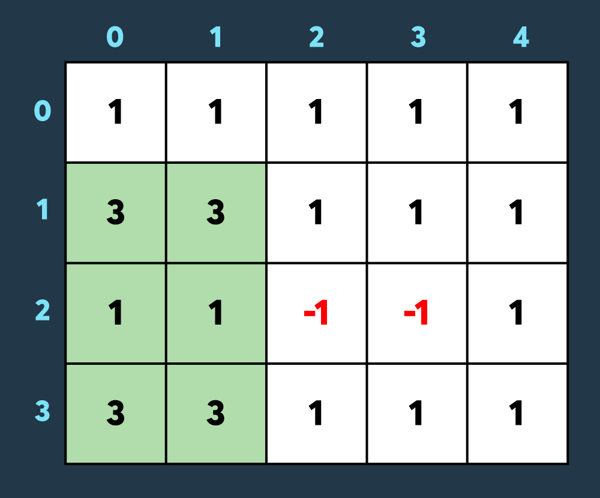
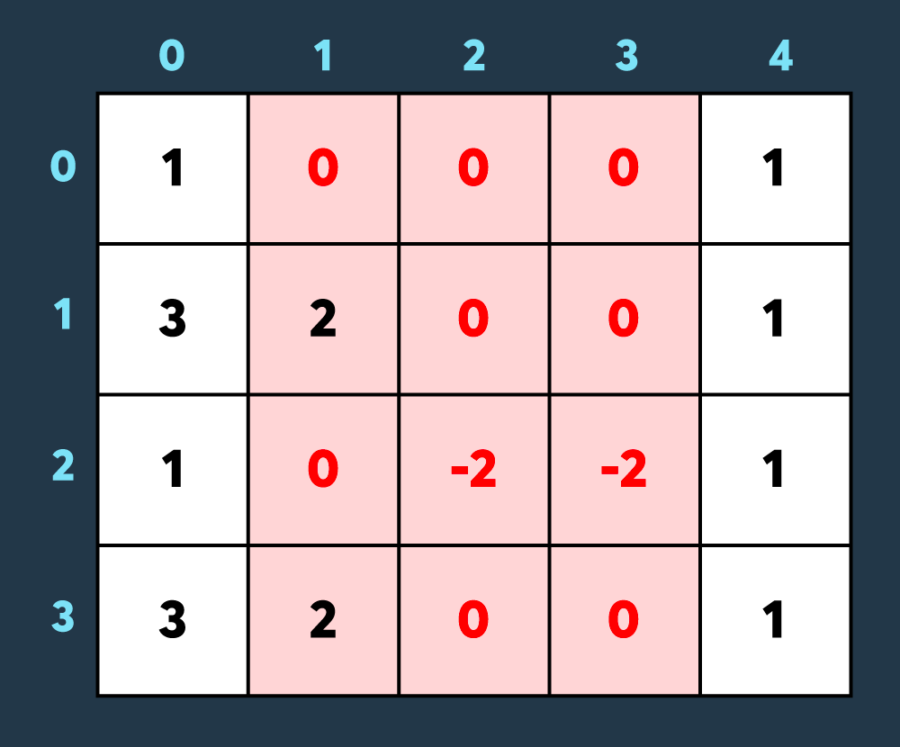

## 파괴되지 않은 건물
https://school.programmers.co.kr/learn/courses/30/lessons/92344

### 문제
N x M 크기의 행렬 모양의 게임 맵이 있습니다. 이 맵에는 내구도를 가진 건물이 각 칸마다 하나씩 있습니다. 적은 이 건물들을 공격하여 파괴하려고 합니다. 건물은 적의 공격을 받으면 내구도가 감소하고 내구도가 0이하가 되면 파괴됩니다. 반대로, 아군은 회복 스킬을 사용하여 건물들의 내구도를 높이려고 합니다.

적의 공격과 아군의 회복 스킬은 항상 직사각형 모양입니다.
예를 들어, 아래 사진은 크기가 4 x 5인 맵에 내구도가 5인 건물들이 있는 상태입니다.

첫 번째로 적이 맵의 (0,0)부터 (3,4)까지 공격하여 4만큼 건물의 내구도를 낮추면 아래와 같은 상태가 됩니다.

두 번째로 적이 맵의 (2,0)부터 (2,3)까지 공격하여 2만큼 건물의 내구도를 낮추면 아래와 같이 4개의 건물이 파괴되는 상태가 됩니다.

세 번째로 아군이 맵의 (1,0)부터 (3,1)까지 회복하여 2만큼 건물의 내구도를 높이면 아래와 같이 2개의 건물이 파괴되었다가 복구되고 2개의 건물만 파괴되어있는 상태가 됩니다.

마지막으로 적이 맵의 (0,1)부터 (3,3)까지 공격하여 1만큼 건물의 내구도를 낮추면 아래와 같이 8개의 건물이 더 파괴되어 총 10개의 건물이 파괴된 상태가 됩니다. (내구도가 0 이하가 된 이미 파괴된 건물도, 공격을 받으면 계속해서 내구도가 하락하는 것에 유의해주세요.)

최종적으로 총 10개의 건물이 파괴되지 않았습니다.

건물의 내구도를 나타내는 2차원 정수 배열 board와 적의 공격 혹은 아군의 회복 스킬을 나타내는 2차원 정수 배열 skill이 매개변수로 주어집니다. 적의 공격 혹은 아군의 회복 스킬이 모두 끝난 뒤 파괴되지 않은 건물의 개수를 return하는 solution함수를 완성해 주세요.